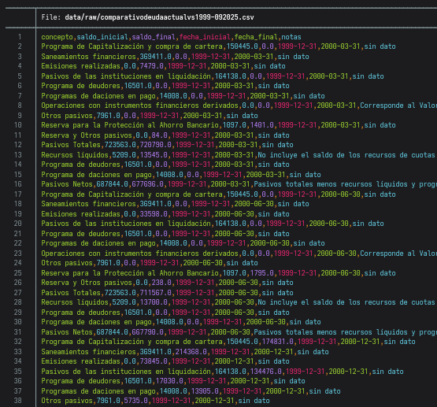
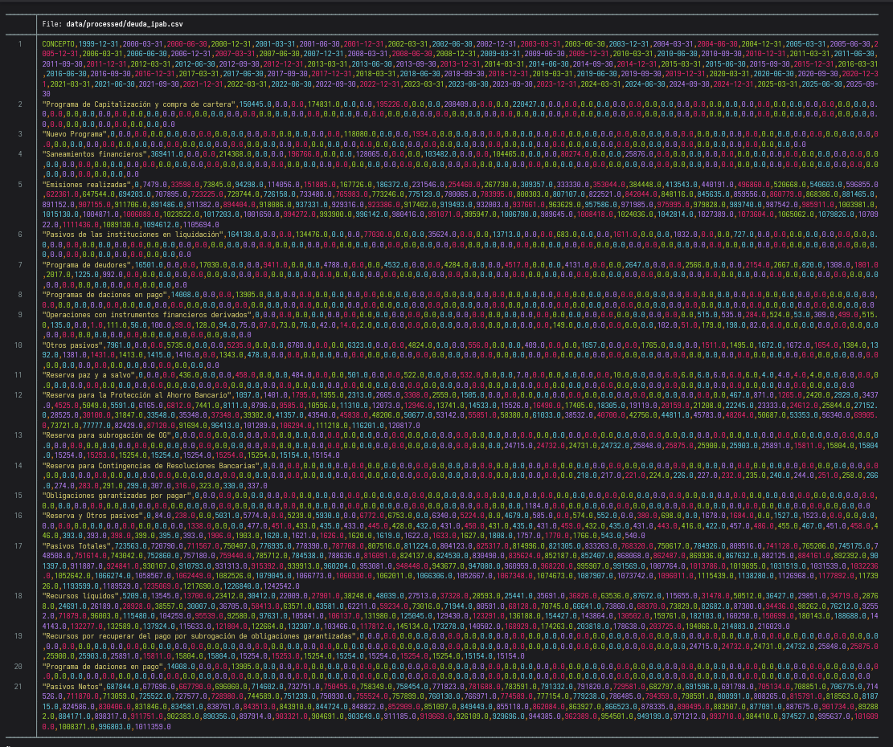
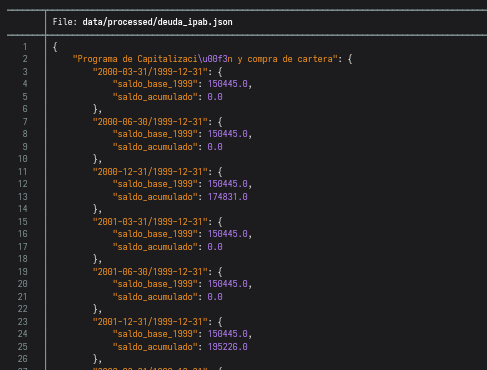

# Comparativo de la deuda del IPAB (1999 - 2025)

El **Instituto para la Protección del Ahorro Bancario (IPAB)** es una institución de nivel federal cuya misión es garantizar los depósitos bancarios de los ahorradores, actuar con el menor coste posible ante problemas financieros y permitir una estabilidad del sistema bancario y del sistema nacional de pagos. Se creó como medida ante los acontecimientos derivados del caso **FOBAPROA** y disolver o controlar la deuda adquirida.

El Gobierno de México pone a su disposición en [datos.gob.mx](https://www.datos.gob.mx/dataset/comparativo_deuda_ipab) el **Comparativo de la deuda del IPAB (septiembre, 2025)** en formato csv para su análisis.

## Dataset de la deuda del IPAB

Se ha manejado el dataset oficial con descarga del día 16/01/2026, cuenta con 1453 registros y pesa aprox. 118 KB. Los nombres de los campos son los siguientes:

| concepto | saldo_inicial | saldo_final | fecha_inicial | fecha_final | notas |
|----------|---------------|-------------|---------------|-------------|-------|

Y analizando el dataset mediante *LibreOffice Calc* (para una visualización cómoda) o con *nvim* (para una visualización rápida) se puede identificar los siguientes puntos:

> Nota: Igualmente se puede utilizar comandos como *awk*, *grep*, etc. en Linux para analizar rápido el csv.

* Se ubica información redudante que dificulta analizar el archivo de manera rápida sin requerir herramientas adicionales
* Es un archivo en el que se agrega "instantáneas" del reporte contable desde **31/12/1999** hasta una determinada fecha de corte del período.
* Aproximadamente cada 16 líneas de registro finaliza una "instantánea" del reporte de deuda y comienza la siguiente.
* Hay 20 cuentas en `conceptos`, los cuales no siempre aparecen en todas los reportes de los distintos periodos.
* La columna `saldo_inicial` guarda el mismo dato de una cuenta en particular en `conceptos`.
* La columna `fecha_inicial` siempre es **31/12/1999**.
* Dicho lo anterior de `saldo_inicial` y `fecha_inicial`, corresponde a la fecha y saldo en el que se decretó el IPAB y en el que inició a operar con los reportes de la deuda del FOBAPROA.
* Los datos de `saldo_final` y `fecha_final` corresponden a los saldos al corte de la fecha de la "instantánea" (o bien, reporte de deuda) agregada al dataset.



> Puedes revisar el archivo csv utilizado [aquí.](data/raw/comparativodeudaactualvs1999-092025.csv)

## Dataset modificado de la deuda del IPAB

Ha pasado por un proceso con la ejecución de scripts en Python y manejo de json el dataset oficial y he llegado a una forma más compacta y visualmente fácil de comprender. Este archivo csv cuenta con 21 líneas (que corresponde a los nombres de los campos y cada una cuenta en conceptos) y pesa aprox. 11.8 KB, **¡una disminución del 90% del tamaño original!** Sin embargo, ahora se cuenta con 93 columnas que se compone así:

| CONCEPTO | 1999-12-31 | 2000-03-31 | ... | 2025-09-30 |
|----------|------------|------------|-----|------------|

Aquí lo que he realicé fue comenzar con la fecha inicial y el saldo inicial que era una información redudante, y esquematicé a modo de que es faćil hallar cada cuenta en conceptos con el periodo (fecha de corte) y obtener el valor al corte de dicha cuenta de una manera visualmente más cómoda y rápida.



> Puedes revisar el archivo csv logrado [aquí.](data/processed/deuda_ipab.csv)

## Proceso

### Analizar el dataset en formato csv

Tras procesos heurísticos de ensayo y error, he realizado este csv en el cual puse a prueba mis habilidades técnicas de informática y en el que estuve en múltiples ocasiones limitado y al borde de lo que podría ejecutar sin recurrir a librería externas y usando con *nvim* puro -sin plugins ni nada por el estilo-.

Leí el archivo csv mediante un script de Python. Obtuve primero los valores las cuentas, los nombres de las filas y las fechas finales. Con ello, realicé una estructura en un diccionario en el que pasaba casi toda la información del csv al diccionario, excepto las `notas`. La estructura del diccionario es la siguiente:

```
{
    "Cuenta A": {
        "Fecha de Corte 1": {
            "Saldo desde 1999": 0.0,
            "Saldo acumulado": 0.0
        },
        "Fecha de Corte 2": {
            "Saldo desde 1999": 0.0,
            "Saldo acumulado": 0.0
        }
    },
    "Cuenta B": {
        "Fecha de Corte 1": {
            "Saldo desde 1999": 0.0,
            "Saldo acumulado": 0.0
        },
        "Fecha de Corte 2": {
            "Saldo desde 1999": 0.0,
            "Saldo acumulado": 0.0
        }
    }
{
```

### Transferir la información del csv a un archivo json

Luego el diccionario lo guardé en un archivo en formato json. Sin embargo, hacerlo de esta manera guarda las cuentas en un orden que no va de acuerdo a la presentación del reporte y como había comentado anteriormente, no todas las cuentas aparecen en todos los periodos. Por lo que requerí tener una lista de las que siempre aparecen y las que no. Las que no siempren aparecen, las busqué en que posición suelen aparecer y los coloco en ese orden. Creé un config en formato json para tener una configuración del orden de las cuentas y poder así generar el json final.



> Puedes consultar el json logrado [aquí](data/processed/deuda_ipab.json) y el script que me permitió generarlo [aquí.](scripts/dataset_manipulation.py)

#### Cargar el archivo json y obtener el csv final

Con un script en Python cargué el archivo json, y mediantes iteraciones cargué en un archivo csv toda la información organizada por cuentas y periodos por lo que la búsqueda se basaría en tener el nombre de la cuenta y el periodo de la fecha de corte.

> Puedes consultar el script [aquí.](scripts/return_clean_dataset.py)

# Tecnologías

  

# Licencia

Este proyecto está bajo la licencia **MIT licence**. Consulta el archivo [LICENSE](LICENSE) para más detalles.
